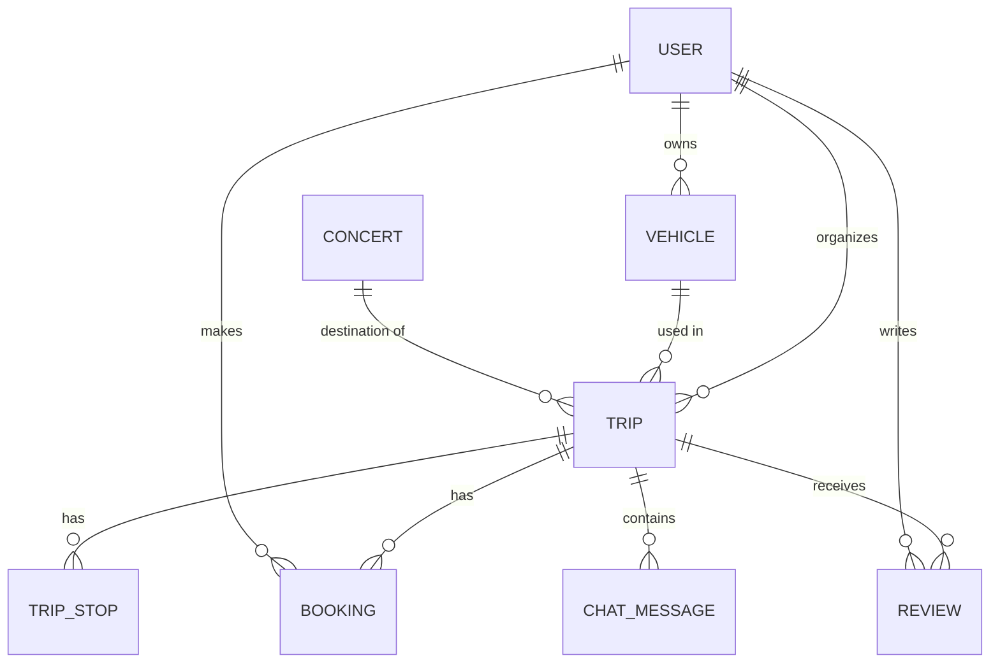

**GigDrive — Product Requirements Document (PRD)**

```markdown
# Product Requirements Document (PRD)
## GigDrive (working title) — Concert Carpool Coordination Platform

| | |
|---|---|
| Version | 0.9 (pre-development baseline) |
| Date | 2026-08-12 |
| Author | [Student name / index] |
| Stack | Angular + RxJS · NestJS · PostgreSQL · Docker |
| Status | Scope baseline agreed; Tier-2 items conditional on timeline |

---

## 1. Background & problem statement

Travelling to concerts in other cities is expensive and logistically annoying: fuel/tolls for a solo driver are high, public transport rarely aligns with event end times, and informal coordination happens in scattered chat threads with no price transparency and no accountability.

**GigDrive** solves this by connecting people going to the same concert: a driver publishes a shared-ride offer with a full cost pool, passengers book seats, and the per-person price drops automatically as more people join. Concerts are discovered by querying an external events API instead of being hand-entered.

## 2. Goals & success criteria

**Course goals (primary)**
- Satisfy every item in the course requirements document (see §12 compliance matrix) within a single, cohesive project.
- Demonstrate clean architecture, clean code (per "Clean Code", R. Martin), and incremental Git history.

**Product goals**
- End-to-end happy path works live: search concert → see trip offers → book seat → driver accepts → group notified / auto-organized.
- Dynamic shared pricing is accurate, transparent, and live-updating.
- Email is the reliable default communication channel; chat and Signal are enhancements.

## 3. Users & roles

- **Guest** — may browse concerts and trip offers (read-only). Actions require auth.
- **Registered user** — can act as **Driver** (organizes trips, owns vehicles) and/or **Passenger** (books seats). Roles are *emergent from actions*, not fixed at registration (agreed decision).
- No separate admin role in scope.

Auth: email + password, Passport.js (LocalStrategy → JWT), bcrypt hashing, ownership guards ("only the trip's driver can accept bookings").

## 4. Core domain concepts

### 4.1 Dynamic shared pricing
- Driver sets: `totalCost` (fuel + tolls + parking), `minPassengers` (go/no-go threshold), `maxPassengers` (≤ vehicle seats), `confirmationDeadline`.
- **Live price per person** = `ceil(totalCost / max(minPassengers, confirmedSeats))`
- Bounds: worst case = `totalCost / min` (guaranteed max), best case = `totalCost / max` (full vehicle).
- Every new confirmed passenger lowers the price for everyone — early-join incentive, recalculated reactively in the UI.
- Example (for README/demo): total 120 €, min 4, max 8 → price band 30 € → 15 €.
- Optional pricing mode: `SHARED_TOTAL` (above) or `FIXED_PER_SEAT` (flat seat price).

### 4.2 Trip lifecycle (state machine)
```
OPEN ──(min reached)──> READY ──(driver confirms)──> CONFIRMED ──> COMPLETED
  │                      │
  └──(deadline, min not met)──> CANCELLED          (auto, via scheduled job)
OPEN ──(seats full)──> FULL (still OPEN-like; reopens if a booking cancels)
```
Booking lifecycle: `PENDING → CONFIRMED | REJECTED`, and `CANCELLED_BY_PASSENGER`.
All transitions server-side only; transition triggers email notifications (§6.5).

### 4.3 Concert cache
Backend proxies the external events API and upserts results into the local `concert` table (`externalId` unique). Trips always reference local rows → trips survive API outages / quota exhaustion. Fallback: **manually created concerts** (`externalId = NULL`, flagged `userSubmitted`) for events missing from the provider (regional coverage gaps).

### 4.4 Seat capacity policy
- `activeSeats = sum(seats of CONFIRMED bookings)`.
- `PENDING` requests do not reserve capacity.
- Capacity re-checked **inside a DB transaction at accept time** (prevents two passengers taking the last seat concurrently).

## 5. Scope

### 5.1 Tier 0 — Must have (MVP)
- Auth (register/login/JWT), user profile with notification preferences (email default ON)
- Concert search (proxied + cached) & concert details; manual concert creation
- Vehicle management (CRUD)
- Trip offer management (CRUD, pickup stops, dynamic pricing, filters)
- Booking flow (request → accept/reject/cancel, capacity-safe)
- Email notifications (Mailtrap SMTP via Nodemailer)
- Driver & passenger dashboards (earnings aggregation, booking statuses, paid flag)
- Reviews (only after trip date, only from confirmed passengers)
- Dockerized PostgreSQL; seed script with demo data

### 5.2 Tier 1 — Committed plan (implemented in this order, both behind feature flags)
1. **In-app trip chat** — NestJS WebSocket gateway, one room per trip, members = driver + confirmed passengers, message history.
2. **Signal group automation** — `signal-cli-rest-api` Docker service; on trip CONFIRMED, backend creates group `🎵 {Artist} — {City}, {date}`, generates invite link, emails it to the crew. *Experimental/unofficial; flag `FEATURE_SIGNAL`; email remains primary channel; no user phone numbers collected.*

### 5.3 Tier 2 — If time allows (priority order)
1. Leaflet + OpenStreetMap pickup-stop maps (free, key-less)
2. Open-Meteo weather widget for concert day (free, key-less — also powers a `zip`/`forkJoin` demo)
3. Waitlist on full trips + auto-notify on free seat
4. CSV passenger manifest export for the driver

### 5.4 Explicitly out of scope
Payment processing, refunds, identity verification, rating moderation, native/mobile apps, SMS/WhatsApp/Viber integrations.

## 6. Functional requirements

### 6.1 Auth & users
| ID | Requirement | Priority |
|---|---|---|
| FR-AUTH-01 | Register with email + password (validated, bcrypt-hashed) | Must |
| FR-AUTH-02 | Login → JWT; protected routes via guard; token attached by HTTP interceptor | Must |
| FR-AUTH-03 | Edit profile incl. notification preference (default: email ON) | Must |
| FR-AUTH-04 | Public user profile: name, average rating, review count | Should |

### 6.2 Concerts
| ID | Requirement | Priority |
|---|---|---|
| FR-CON-01 | Instant search: keyword, city, radius, date range, genre; debounced, cancel-stale (`switchMap`) | Must |
| FR-CON-02 | Results upserted into local cache; trips reference cached rows | Must |
| FR-CON-03 | Concert details page: info + linked trips | Must |
| FR-CON-04 | Manual concert creation by registered users | Must |

### 6.3 Trips
| ID | Requirement | Priority |
|---|---|---|
| FR-TRIP-01 | Create trip: vehicle, concert, totalCost, min/max passengers, deadline, pickup stops, round-trip flag, pricing mode | Must |
| FR-TRIP-02 | Validation: `min ≤ max ≤ vehicle.seats`, deadline < concert date | Must |
| FR-TRIP-03 | Browse/filter trips per concert: departure city, vehicle type, price band, seats left, min driver rating; sorting (cheapest, "most likely to happen") | Must |
| FR-TRIP-04 | Live per-person price displayed and reactively recomputed | Must |
| FR-TRIP-05 | Driver actions: edit (while OPEN), confirm (READY→CONFIRMED), cancel | Must |
| FR-TRIP-06 | Scheduled job: past-deadline OPEN trips with min not met → CANCELLED + notify | Must |

### 6.4 Bookings
| ID | Requirement | Priority |
|---|---|---|
| FR-BOOK-01 | Passenger requests N seats → PENDING; driver emailed | Must |
| FR-BOOK-02 | Driver accepts (transactional capacity check) / rejects; passenger emailed | Must |
| FR-BOOK-03 | Passenger cancels own booking; seat frees up; price recomputed | Must |
| FR-BOOK-04 | Driver marks booking "paid" (informational only) | Should |
| FR-BOOK-05 | Waitlist when FULL | Tier 2 |

### 6.5 Communication
| ID | Requirement | Priority |
|---|---|---|
| FR-COMM-01 | Emails on: booking requested, accepted, rejected, trip READY, trip CONFIRMED, trip CANCELLED, T-24h reminder | Must |
| FR-COMM-02 | Per-trip WebSocket chat room (driver + confirmed passengers) | Tier 1 |
| FR-COMM-03 | Signal group auto-created + invite link emailed on CONFIRMED | Tier 1 |

### 6.6 Reviews
| ID | Requirement | Priority |
|---|---|---|
| FR-REV-01 | Confirmed passenger may review driver once trip date passed (1–5 + comment) | Must |
| FR-REV-02 | Driver rating surfaced on trip cards & profiles | Must |

## 7. Non-functional requirements
- **Clean code**: feature modules both ends; DTOs + class-validator everywhere; no entities exposed from controllers; small functions, meaningful names (course grading criterion).
- **Secrets**: all via `.env`, never committed (Ticketmaster key, SMTP creds, JWT secret, Signal number).
- **Time**: datetimes stored UTC (ISO), displayed local.
- **DevEx**: docker-compose one-command start; seed script (demo driver, vehicles, cached concerts, a nearly-full trip) for reproducible demos.
- **Git**: incremental commits per milestone (course requirement), conventional commit messages, README with setup + screenshots.
- **Reliability**: quota-safe API usage via cache; graceful degradation if Ticketmaster down (serve cached data).

## 8. Domain model



| Entity | Key fields |
|---|---|
| `user` | id, email (unique), passwordHash, firstName, lastName, phone?, emailNotifications (default true) |
| `vehicle` | id, ownerId→user, type (CAR/VAN/MINIBUS), make, model, seats, notes |
| `concert` | id, externalId (unique, nullable), userSubmitted flag, artist, title, venue, city, country, lat/lng?, startAt, imageUrl, genre, ticketUrl |
| `trip` | id, driverId→user, vehicleId→vehicle, concertId→concert, pricingMode, totalCost, currency (EUR/RSD), minPassengers, maxPassengers, deadline, departureAt, roundTrip, notes, status |
| `trip_stop` | id, tripId→trip, seq, place, lat/lng?, plannedTime |
| `booking` | id, tripId→trip, passengerId→user, seats, status, paid flag, createdAt, decidedAt |
| `review` | id, tripId→trip, authorId→user, rating (1–5), comment, createdAt |
| `chat_message` | id, tripId→trip, authorId→user, body, sentAt |

Enums: `VehicleType`, `TripStatus`, `BookingStatus`, `PricingMode` (module-level, not DB-dependent).

## 9. API surface (REST summary)

| Area | Endpoints |
|---|---|
| Auth | `POST /auth/register` · `POST /auth/login` · `GET /auth/me` |
| Users | `GET /users/:id` · `PATCH /users/me` |
| Vehicles | `GET/POST /vehicles` · `PATCH/DELETE /vehicles/:id` |
| Concerts | `GET /concerts/search?q&city&dateFrom&dateTo&genre&page` · `GET /concerts/:id` · `POST /concerts` (manual) |
| Trips | `POST /trips` · `GET /trips?concertId&from&vehicleType&maxPrice&minRating&seatsMin` · `GET /trips/:id` (incl. live price) · `PATCH /trips/:id` · `POST /trips/:id/confirm` · `GET /trips/mine` |
| Bookings | `POST /trips/:id/bookings` · `GET /bookings/mine` · `POST /bookings/:id/accept|reject` · `POST /bookings/:id/cancel` · `PATCH /bookings/:id/paid` |
| Reviews | `POST /trips/:id/reviews` · `GET /users/:id/reviews` |
| Chat | `WS /chat` (trip rooms) · `GET /trips/:id/messages` (history) |

Guards: JWT globally; ownership rules per resource; review guard checks confirmed booking + past concert date.

## 10. External integrations
| Service | Use | Notes |
|---|---|---|
| Ticketmaster Discovery API | Concert/venue/artist data | Free key; 2 rps, 5000 req/day → backend proxy + cache mandatory; key in `.env` |
| Mailtrap (SMTP) + Nodemailer | All transactional email | Dev/demo inboxes; switch to real SMTP via env only if needed |
| signal-cli-rest-api | Signal group automation | Extra service in docker-compose (profile `signal`); unofficial — experimental; invite-link flow avoids collecting phone numbers |
| Open-Meteo | Weather widget | Tier 2; no key required |
| OpenStreetMap + Leaflet | Pickup-stop maps | Tier 2; no key required |

## 11. Architecture & tech stack
- **Frontend**: Angular (feature folders: auth, concerts, trips, bookings, profile; lazy routes; guards; reactive forms; OnPush where beneficial), RxJS, **NgRx Store + Entity + Effects**.
- **Backend**: NestJS modules: `auth`, `users`, `vehicles`, `concerts`, `trips`, `bookings`, `reviews`, `notifications`, `chat`, `integrations`(ticketmaster, signal). TypeORM (+migrations), `@nestjs/schedule` for deadline sweep, Nodemailer, Swagger.
- **Infra**: docker-compose → `db` (postgres), `backend`, `frontend` (nginx), `signal-cli` (optional profile).

## 12. Course compliance matrix
| Course requirement | Where demonstrated |
|---|---|
| map / reduce / filter / forEach | price-band calc, driver earnings aggregation, availability & list transforms |
| fetch API, Promise (async) | dedicated `fetch`-based service (e.g. file upload / provider health-check) with async/await |
| switchMap, take, takeUntil | debounced concert search; `takeUntil` teardown; `take(1)` one-shot actions |
| zip / merge (+ combinational op) | `zip(eventDetails$, weather$)`; `merge(manualRefresh$, poll$)` for status refresh; `combineLatest([trips$, filters$])` for reactive filtering & live price |
| Angular components & services | presentational trip cards vs container pages; feature services |
| @Input / @Output | filters, trip card, booking list components |
| Dependency injection | services/interceptors throughout |
| NgRx store + entities | `@ngrx/entity` adapters for trips & bookings collections |
| NgRx effects | all async HTTP (concerts, trips, bookings, auth) |
| Routing | lazy feature routes, auth guard, trip details param routes |
| DB connection | TypeORM → PostgreSQL |
| DB via Docker | `db` service in docker-compose |
| CRUD over entities | vehicles / trips / bookings / concerts / reviews |
| ≥3 entities with relations | 8 entities, relations per ERD (§8) |
| Passport.js auth | LocalStrategy (login) + JWT strategy (protected routes), bcrypt, guards |

## 13. Development plan (milestones ≈ commit phases)
1. **M0 Setup** — repo, README, docker-compose + Postgres, NestJS + TypeORM init, lint/format
2. **M1 Auth** — users, Passport local + JWT, guards
3. **M2 Concerts** — Ticketmaster service, cache upsert, search endpoints, manual creation
4. **M3 Core CRUD** — vehicles → trips (business rules) → bookings (transactional capacity) + state transitions
5. **M4 Notifications** — Nodemailer + Mailtrap, lifecycle email hooks
6. **M5 Angular shell** — routing, auth pages, interceptor, guards
7. **M6 NgRx** — store, entity adapters, effects
8. **M7 Concert search UI** — debounced `switchMap`
9. **M8 Trip browsing** — details, reactive filters & live price (`combineLatest`)
10. **M9 Trip & vehicle forms** — reactive forms, validation
11. **M10 Booking flows** — passenger + driver dashboards
12. **M11 Reviews & polish** — seeds, README, screenshots
13. **M12 Tier 1** — chat → Signal automation; **M13 Tier 2** — maps → weather → waitlist → CSV

**Scope ladder (contingency):** if time shrinks → drop in order: Signal → chat (email + "paid" flags remain full product). If time grows → Tier 2 list in order.

## 14. Risks & mitigations
| Risk | Mitigation |
|---|---|
| Signal client unofficial (ToS gray area; number restriction risk) | Feature-flagged, invite-link flow, email primary, documented as experimental |
| Thin regional event coverage in Ticketmaster | Manual concert creation fallback; pre-seed demo concerts |
| External API quota/outage | Mandatory server-side cache; serve stale data |
| Concurrent booking of last seat | Transactional capacity check at accept time |
| Timeline pressure | Tiered scope ladder (§13) |
| Email deliverability during demo | Mailtrap UI shown live; all mail events also logged |

## 15. Decisions log
- Roles emergent (any user can drive & ride) — agreed
- Mailtrap for email — agreed
- Signal + in-app chat committed; maps/weather/waitlist/CSV conditional — agreed
- No payments integration ("paid" flag only) — agreed
- Backend proxies all external APIs — architectural rule

## 16. Open questions
- Final product name (working title: GigDrive)
- UI language: English vs Serbian (recommend English for portfolio, unless course requires otherwise)
- Demo SMTP: stay on Mailtrap or configure real sender before defense?
```

A few notes on what's in there and how to use it:

- **It's written to be committed** — drop it in your repo as `docs/PRD.md`. The mermaid ERD and state diagram will render natively on GitHub, and the compliance matrix in §12 is your defense cheat-sheet: it maps every line of the requirements doc to a concrete feature.
- **The scope ladder (§13)** directly encodes what you told me: Signal → chat get cut first if time runs short, maps/weather/waitlist/CSV get added in that order if you have surplus time. Your MVP never depends on any of them.
- **One thing I added that we didn't explicitly discuss:** a scheduled backend job (using `@nestjs/schedule`) that auto-cancels trips whose minimum wasn't reached by the deadline. It's a small piece that makes the whole pricing concept feel complete in a demo.
- **Open questions at the bottom** are worth resolving early — especially UI language, since some courses expect Serbian.

If you know roughly when your deadline is, I can turn §13 into a week-by-week plan with realistic effort estimates per milestone. Want that, or would you rather go deeper on something technical first — like the detailed REST spec with DTOs, or the NgRx state shape?
